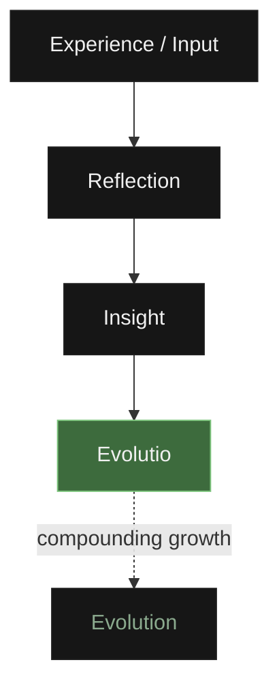

<p align="center">
  
</p>

# Hermes: A Founding Document

Every day we consume an overwhelming amount of information, but very little of it actually changes who we become. Hermes exists to answer a single, practical question: what happens to the knowledge we consume after the tab is closed?

Modern software is built almost entirely around consumption and completion. We are handed countless tools to track daily habits, check off tasks, bookmark articles, and optimize our workflows, measuring our success by the number of boxes ticked, the length of our streaks, and the sheer volume of data processed. But completion is not understanding. Checking off a task doesn't mean you've learned anything, and hoarding bookmarks in a read-later app doesn't mean that information has been internalized.

> Hermes does not measure activity.
> 
> Hermes measures changed thinking.

I started building Hermes because I needed a system that I personally wanted to use every day—not another generic productivity app that nags you with badges and overbuilt dashboards. I wanted a quiet, local, and fiercely intentional space designed to help transform raw information into genuine understanding, and understanding into compounding growth over time. It is built to preserve the rare moments where your perspective fundamentally shifts.

This document is written for myself five years from now, for future teammates, and for anyone curious about why this system was built. It outlines the core principles behind the software, because while features and UI details will inevitably change, the underlying design philosophy should not.

## The Hermes Laws

Hermes refuses to become another attention-seeking engagement platform. To protect your focus, the software strictly enforces the following constraints:

❌ No streaks
❌ No XP
❌ No coins
❌ No leaderboards
❌ No notifications asking you to return
❌ No infinite scrolling
❌ No advertisements

Hermes should never compete for your attention. It is a tool that sits quietly on your machine, waiting until you deliberately choose to return.

## Why the Name "Hermes"?

The name wasn't chosen out of a casual obsession with mythology; it serves as a practical metaphor for what the software actually does. In ancient tradition, Hermes was the messenger—the entity capable of traversing different realms and crossing borders that others could not.

In this system, Hermes represents the movement and translation of knowledge. Ideas travel, and real understanding requires bridging the gap between what you encountered yesterday and what you synthesize today. The application exists to serve as that bridge, helping you move raw notes across the threshold of mere consumption into internalized understanding.

## Intentionality

Intentionality is the bedrock of the entire application. Modern software has trained us to passively receive information—we doom-scroll, we let algorithms queue up our next video, and we allow apps to automatically sync endless feeds of unread content.

Hermes demands the opposite: nothing enters your workspace accidentally. Every single piece of knowledge must be manually and deliberately added by you. Requiring this manual friction creates stronger psychological ownership over your data. When you actively decide to bring a question, an article, or an idea into your workspace, you are making a conscious commitment to engage with it rather than acting as a passive receptacle for algorithmic feeds.

## The Interface as a Philosophy

A tool's interface shapes how you think while using it, which is why the visual design of Hermes is treated as a core part of the product philosophy rather than an afterthought.

**Today's Pursuit** is designed around focused attention rather than overwhelming choice. Presenting a user with a hundred tasks creates anxiety and decision fatigue, while keeping the daily view to a few intentional items fosters calm and execution.

**Pinned Domains** exist because we naturally return to the same core areas of study and work over and over. Reducing friction here is critical: if accessing your most important projects takes too many clicks through nested folders, you will simply stop maintaining them.

The **calm typography** and **generous whitespace** are structured to make reading and writing feel like an uncluttered sanctuary, while **cards** are kept deliberately lightweight. When you are working with complex or dense concepts, the container should never distract from the content.

Why **OLED Black**? Because bright, high-contrast colors alarm the nervous system and draw attention to the UI itself. True OLED black recedes completely into the background, allowing the software interface to disappear so nothing stands between you and the work in front of you.

## The Structure of Knowledge

Flat folder structures usually fail over time because they lack context and inevitably devolve into chaotic digital junk drawers. To keep information organized without overcomplicating things, Hermes enforces a straightforward four-tier organizational hierarchy:

```
Workspace → Domain → Block → Item
```

**Workspaces** address the high cognitive cost of context switching. When you are studying pure mathematics, you shouldn't be distracted by your grocery list or startup ideas. Workspaces create distinct, sealed environments for different identities or areas of focus.

Within a workspace, **Domains** represent long-term pillars like Engineering, Philosophy, or Health. Rather than dumping files into temporary project folders that get forgotten, domains act as permanent territories of ongoing study and practice.

Inside those domains, **Blocks** group related knowledge into focused subjects—like Python, Deep Learning, or Product Design—providing a solid container for your actual working materials. Finally, individual **Items** (such as notes, articles, and research questions) live inside these blocks.

## The Cognitive Loop

While the structural hierarchy organizes where your files live, the application workflow is designed around how understanding actually develops over time:



An experience is simply what you encounter—an article you read, a difficult bug you solved, or a conversation you had. Reflection is the deliberate act of pausing to examine that material, which occasionally sparks a genuine insight.

When an insight is substantial enough to change how you think or operate, you record it as an **Evolutio**—a permanent, atomic note of that shift. Evolution isn't a separate feature or button in the app; it is simply the compounding result of those realized shifts accumulated over months and years. Most software stops at capturing the initial input (the saved bookmark, the task checkbox), leaving you with a graveyard of unread content. Hermes is structured to help you push through to actual synthesis.

## Veritas

Veritas is the Latin word for truth, and in Hermes, it is the mechanism for recording reality when life inevitably interrupts your pursuits.

Why does Veritas exist? Because traditional habit trackers lie. If you study for 100 days, miss a single day because you caught the flu or had an emergency, and the app resets your streak to zero, the software is lying about your actual progress. It uses guilt and fear of breaking a streak to artificially drive daily engagement. Guilt-driven productivity eventually fails because it punishes users for living a normal human life.

Veritas replaces guilt with objective record-keeping. When you miss a day in Hermes, you don't lose points or see a broken chain. You simply record a Veritas—a short, honest explanation of why you paused. Maybe you were exhausted, prioritizing your family, or simply needed rest. Recording reality as it happened is infinitely healthier and more sustainable than pretending you possess machine-like consistency.

## Evolutio

An Evolutio is a documented cognitive shift, serving as the atomic unit of growth in Hermes. The term is intentionally singular because an Evolutio represents a distinct, standalone realization rather than a generic collection of notes.

Not every reflection becomes an Evolutio, because genuine understanding cannot be forced. You might read ten articles and write ten reflection notes, yet only experience a single real cognitive shift. Those moments of genuine clarity are rare, and Hermes measures your progress by counting these synthesized realizations rather than your checked boxes or reading volume. In the end, changed thinking is the only metric that actually matters in personal development.

## The Anatomy of an Item

Knowledge in Hermes is structured into specific item types designed for different working needs.

**Questions** serve as a first-class item type for tracking unresolved problems and active research topics. Storing an explicit question keeps the inquiry visible in your workspace until you arrive at a verified answer or solution.

The built-in **Reader Engine** processes raw web articles and renders them locally. It strips out external web styling, ads, and tracking scripts to present a clean reading view, with native rendering support for Markdown and LaTeX mathematical notation.

For notes and writing, Hermes uses standard **Markdown**. Storing data in plain text rather than proprietary database formats ensures long-term file portability and guarantees your notes can be opened in any standard text editor decades from now.

## The Knowledge Pipeline

Hermes regulates how content enters your workspace through manual imports, RSS feeds, and curated community sources.

Why are there no automatic AI recommendations? Because having an AI suggest what you should read or learn next violates the core principle of intentionality. You must actively choose to pull knowledge into your workspace based on your own curiosity and goals. Hermes provides the plumbing to ingest and organize information, but you must be the one turning the valve.

## Search and Archive

**Search** in Hermes indexes full-text content and conceptual keywords rather than relying strictly on file paths and folder titles. Because human memory is associative, querying by quotes, terms, or related ideas makes it straightforward to locate notes even when you forget where they were originally filed.

When you remove an item from your active workspace, Hermes **archives** it instead of deleting it permanently. A background archival routine (Felix) manages inactive items, preserving their tags and structural links so they can be restored cleanly if the topic becomes relevant again later.

## Offline First & .hermes Bundles

Hermes is built offline-first by default. This architecture is rooted in data ownership and software longevity: your notes and research should never depend on a third-party server remaining online, nor should access to your own files be held hostage by a subscription fee. By storing data in local SQLite databases and plain Markdown files, Hermes ensures you retain physical ownership of your data on your own filesystem.

To make collaboration and backup seamless without introducing vendor lock-in, Hermes uses **`.hermes` bundles**—compressed, standardized archives of your data. You can export a specific Block or Domain, share the file with a colleague, and they can import it directly into their workspace. Because the underlying serialization format is open and documented, long-term accessibility is guaranteed.

## Long-Term Vision & Open Source

This project is intended to evolve over many years, prioritizing architectural longevity over fleeting development trends. While underlying tech stacks and UI frameworks will change, the core principles should remain understandable and intact.

Hermes is open source because ideas need freedom to evolve. We aren't claiming this is the *only* correct way to learn or organize information—it is simply the philosophy that built this tool. Dogmatically insisting on a single correct system builds a cage; sharing a set of principles and inviting others to adapt them builds a community.

Contributions and improvements are always welcome. If someone forks Hermes and builds a tool that serves people better, that isn't a failure—it means the core ideas continued to grow. Philosophy and utility matter far more than market ownership. If this approach resonates with you, build with us.

## The Architect

Hermes began as a personal project to build the exact environment I needed to cultivate my own understanding, and it is dedicated to the community and teams forming around it. I invite you to test these ideas, contribute to the codebase, or adapt this philosophy for your own workflow.

You can find me and follow the journey here: [github.com/Harshajaya13](https://github.com/Harshajaya13)

---

We cannot promise that Hermes will make you ten times more productive. We simply hope it helps you become more thoughtful.

If, years from now, you open Hermes and discover an honest record of how your mind grew and changed, then it has fulfilled its purpose.
